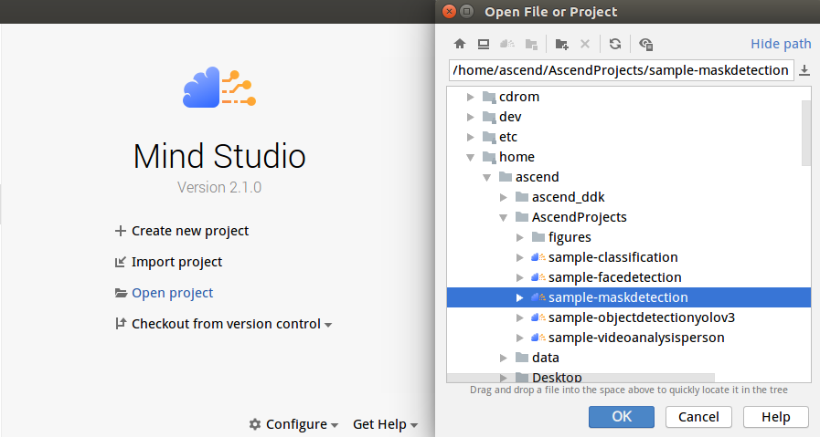
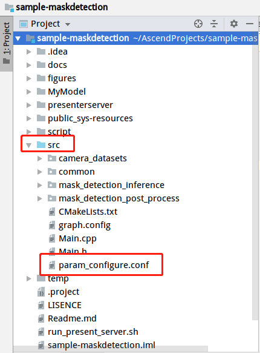
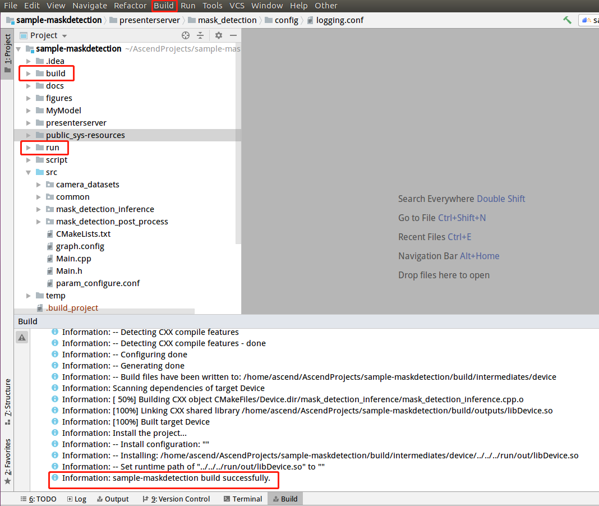
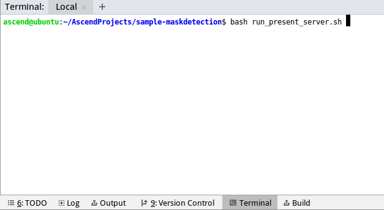
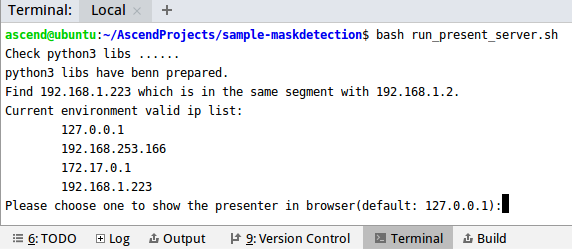
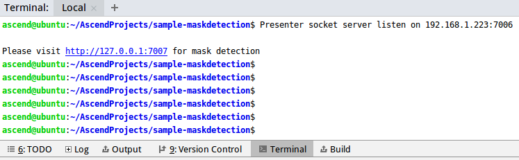
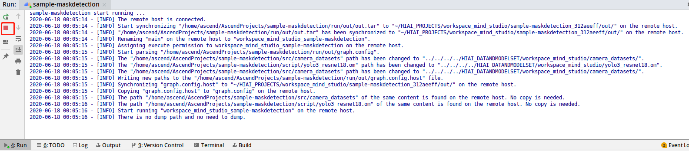
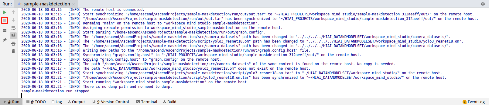

EN|[CH](Readme_cn.md)

# Mask Detection<a name="ZH-CN_TOPIC_0208834076"></a>

Developers can deploy the application on the Atlas 200 DK to collect camera data in real time and predict masks, facial and human information in the video.

The applications in the current version branch adapt to [DDK&RunTime](https://ascend.huawei.com/resources) 1.32.0.0 and later.

## Prerequisites<a name="zh-cn_topic_0203223294_section137245294533"></a>

Before using an open source application, ensure that:

Mind Studio has been installed.
The Atlas 200 DK developer board has been connected to Mind Studio, the cross compiler has been installed, the SD card has been prepared, and basic information has been configured.

## Deployment<a name="zh-cn_topic_0228461904_section412811285117"></a>

You can use either of the following methods:

1.  Quick deployment: visit [https://github.com/Atlas200dk/faster-deploy](https://github.com/Atlas200dk/faster-deploy)  。

    > **NOTE：**   
    >-   The quick deployment script can be used to deploy multiple samples rapidly. Select the mask detection deployment sample.
    >-   The quick deployment script automatically completes code download, model conversion, and environment variable configuration. To learn about the detailed deployment process, go to: **[2. Common deployment](#zh-cn_topic_0228461904_li3208251440)**  

2.  <a name="zh-cn_topic_0228461904_li3208251440"></a>Common deployment: visit [https://github.com/Atlas200dk/sample-README/tree/master/sample-maskdetection](https://github.com/Atlas200dk/sample-README/tree/master/sample-maskdetection)  。

    > **NOTE：**   
    >-   In this deployment mode, you need to manually download code, convert models, and configure environment variables.

## Build<a name="zh-cn_topic_0203223294_section7994174585917"></a>

1.  Open corresponding project.

    Go to the directory that stores the decompressed installation package as the Mind Studio installation user in Terminal, for example, $HOME/MindStudio-ubuntu/bin. Run following command to start Mind Studio.
    
    **./MindStudio.sh**

    Open **sample-maskdetection** project，as shown in[Figure6  Open Maskdetection Project](#zh-cn_topic_0203223294_fig05481157171918).

    **Figure 6**  Open Maskdetection Project<a name="zh-cn_topic_0203223294_fig05481157171918"></a>  
    

    

2.  Configure project information in file: **src/param\_configure.conf**.

    As shown in[Figure7 Configuration File Path](#zh-cn_topic_0203223294_fig0391184062214).

    **Figure 7**  Configuration File Path<a name="zh-cn_topic_0203223294_fig0391184062214"></a>  
    

    

    The default configurations of the configuration file are as follows:

    ```
    remote_host=192.168.1.2
    data_source=Channel-1
    presenter_view_app_name=video
    ```

    -   remote\_host: IP address of the Atlas 200 DK developer board
    -   data\_source: camera channel. The value can be Channel-1 or Channel-2. For details, see "Viewing the Channel to Which a Camera Belongs" in [Atlas 200 DK User Guide](https://ascend.huawei.com/doc/Atlas200DK/).
    
    -   presenter\_view\_app\_name : value of View Name on the Presenter Server page, which must be unique. The value consists of at least one character and supports only uppercase letters, lowercase letters, digits, and "/". 

    > **NOTE:**   
    >-   All the three parameters must be set. Otherwise, the build fails.
    >-   Do not use double quotation marks ("") during parameter settings.
    >-   Modify the default configurations as required.

3.  Run deploy.sh script to adjust configuration parameters and download and compile the third-party library. Open the Terminal window of Mind Studio. By default, the home directory of the code is used. Run the deploy.sh script in the background to deploy the environment, as shown in [Figure8 Running deploy.sh script](#zh-cn_topic_0203223294_fig107831626101910).

    **Figure 8**  Running deploy.sh script<a name="zh-cn_topic_0203223294_fig107831626101910"></a>  
    

    > **NOTE:**   
    >-   During the first deployment, if no third-party library is used, the system automatically downloads and builds the third-party library, which may take a long time. The third-party library can be directly used for the subsequent build.
    >-   During deployment, select the IP address of the host that communicates with the developer board. Generally, the IP address is that configured for the virtual NIC. If the IP address is in the same network segment as the IP address of the developer board, it is automatically selected for deployment. If they are not in the same network segment, you need to manually type the IP address of the host that communicates with the developer board to complete the deployment.

4.  Start building. Open Mind Studio and choose **Build \> Build \> Build-Configuration** from the main menu. The build and run folders are generated in the directory, as shown in [Figure9 Build and generate files](#zh-cn_topic_0203223294_fig1625447397)

    **Figure 9**  Build and generate files<a name="zh-cn_topic_0203223294_fig1625447397"></a>  
    

    

    > **NOTICE:**   
    >When you build a project for the first time, **Build \> Build** is unavailable. You need to choose **Build \> Edit Build Configuration** to set parameters before the build.  

5.  Start Presenter Server。

    Open the Terminal window of Mind Studio. Under the code storage path, run the following command to start the Presenter Server program of the mask detection application on the server, as shown in [Figure10 Start Presenter Server](#zh-cn_topic_0203223294_fig423515251067):

    **bash run\_present\_server.sh**

    **Figure 10**  Start Presenter Server<a name="zh-cn_topic_0203223294_fig423515251067"></a>  
    

    

    When the message “**Please choose one to show the presenter in browser\(default: 127.0.0.1\):**” is displayed, type the IP address (usually IP address for accessing Mind Studio) used for accessing the Presenter Server service in the browser.

    Select the IP address used by the browser to access the Presenter Server service in “**Current environment valid ip list**”, as shown in [Figure11 Project Deployment](#zh-cn_topic_0203223294_fig999812514814).

    **Figure 11**  Project Deployment<a name="zh-cn_topic_0203223294_fig999812514814"></a>  
    

    

    [Figure12 Starting Presenter Server Process](#zh-cn_topic_0203223294_fig69531305324) shows that the Presenter Server service has been started successfully.

    **Figure 12**  Starting Presenter Server Process<a name="zh-cn_topic_0203223294_fig69531305324"></a>  
    

    

    Use the URL shown in the preceding figure to log in to Presenter Server. The IP address is that typed in [Figure13 Home page](#zh-cn_topic_0203223294_fig999812514814) and the default port number is 7007. The following figure indicates that Presenter Server has been started successfully.

    **Figure 13**  Home Page<a name="zh-cn_topic_0203223294_fig64391558352"></a>  
    

    The following figure shows the IP address used by Presenter Server and Mind Studio to communicate with the Atlas 200 DK.

    **Figure 14**  IP Address Example<a name="zh-cn_topic_0203223294_fig1881532172010"></a>  
    

    In the preceding figure:

    -   The IP address of the Atlas 200 DK developer board is 192.168.1.2 (connected in USB mode).
    -   The IP address used by Presenter Server to communicate with the Atlas 200 DK is in the same network segment as the IP address of the Atlas 200 DK on the UI Host server, for example, 192.168.1.223.
    -   The following describes how to access the IP address (such as 10.10.0.1) of Presenter Server using a browser. Because Presenter Server and Mind Studio are deployed on the same server, you can access Mind Studio through the browser using the same IP address.


## Running<a name="zh-cn_topic_0203223294_section551710297235"></a>

1.  Run Mask Detection Project

    On the toolbar of Mind Studio, click Run and choose **Run \> Run 'sample-maskdetection'**. As shown in [Figure15 Application Running Sample](#zh-cn_topic_0203223294_fig93931954162719), the executable application is running on the developer board.

    **Figure 15**  Application Running Sample<a name="zh-cn_topic_0203223294_fig93931954162719"></a>  
    

    

2.  Use the URL displayed upon the start of the Presenter Server service to log in to Presenter Server.

    Wait for Presenter Agent to transmit data to the server. Click **Refresh**. When there is data, the icon in the Status column for the corresponding channel changes to green, as shown in the following figure.

    **Figure 16**  Presenter Server Page<a name="zh-cn_topic_0203223294_fig113691556202312"></a>  
    

    > **NOTE:**   
    >-   For the face detection application, Presenter Server supports a maximum of 10 channels at the same time (each _presenter\_view\_app\_name_ parameter corresponds to a channel).
    >-   Due to hardware limitations, each channel supports a maximum frame rate of 20 fps. A lower frame rate is automatically used when the network bandwidth is low. 

3.  Click the link (such as **video** in the preceding figure) in the View Name column to view the result. The confidence of the detected human face is marked.

## Follow-up Operations<a name="zh-cn_topic_0203223294_section177619345260"></a>

-   **Stop Mask Detection Application**

    Mask Detectionis running continually after being executed. To stop it, perform the following operation:

    Click the stop button shown in [Figure17 Stop Mask Detection Application](#zh-cn_topic_0203223294_fig14326454172518) to stop mask detection project.

    **Figure 17**  Stop Mask Detection Application<a name="zh-cn_topic_0203223294_fig14326454172518"></a>  
    

    

    [Figure18 Mask Detection Stopped](#zh-cn_topic_0203223294_fig2182182518112) shows that mask detection application has been stopped.

    **Figure 18**  Mask Detection Stopped<a name="zh-cn_topic_0203223294_fig2182182518112"></a>  
    

    

-   **Stopping Presenter Server service**

    The Presenter Server service is always in running state after being started. To stop the Presenter Server service of Mask Detection application, perform the following operations:

    On the server with Mind Studio installed, run the following command as the Mind Studio installation user to check the process of the Presenter Server service corresponding to Mask Detection.

    **ps -ef | grep presenter | grep mask\_detection**

    ```
    ascend@ascend-HP-ProDesk-600-G4-PCI-MT:~/sample-maskdetection$ ps -ef | grep presenter | grep mask_detection
    ascend    7701  1615  0 14:21 pts/8    00:00:00 python3 presenterserver/presenter_server.py --app mask_detection
    ```

    In the preceding information, 7701 indicates the process ID of the Presenter Server service for mask\_detection.

    To stop the service, run the following command:

    **kill -9** _7701_


